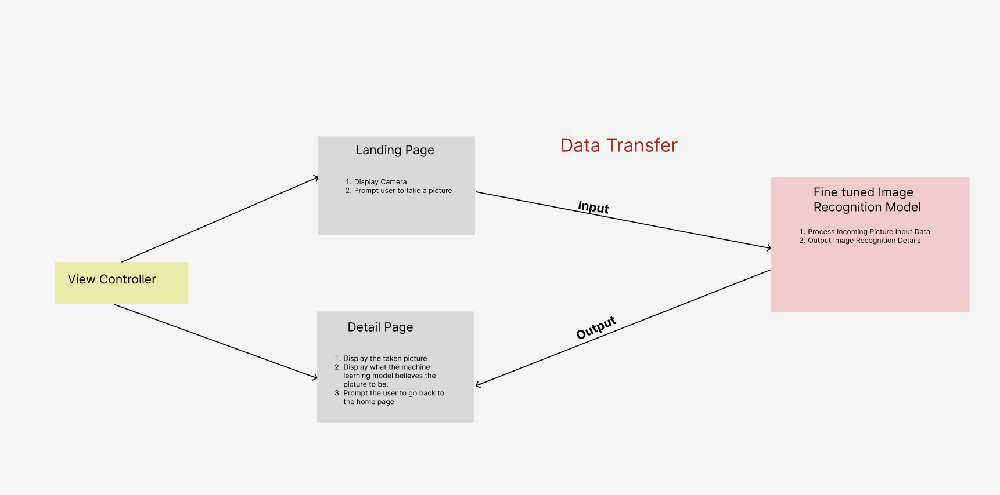

# Nature ID 

## Table of Contents

1. [Overview](#Overview)
2. [Product Spec](#Product-Spec)
3. [Wireframes](#Wireframes)

## Overview

### Description

Nature ID is an application that allows users to take pictures of plants and animals and identify them. The application will use a machine learning model to identify the plants and animals. The application will be able to handle cases where the model is not sure what the image is and allow the user to take more pictures or another picture to get a more accurate identification.

### Features

1. Small machine learning model that can process images offline and be able to stored on the device. The model would be a fine tuned model based on a pre-trained model and trained on Kaggle dataset of plants and animals. 

2. Capable of taking pictures. 

3. Capable of giving a list of what the model thinks the image is.

4. Handle cases where the model is not sure what the image is.

5. Allow the user to take more pictures or another picture to get a more accurate identification.

### App Evaluation

- **Category:**
    - Nature
- **Mobile:**
    - Mobile is essential for this application as it requires a camera to take pictures of plants and animals.
- **Story:**
    - The application will allow users to take pictures of plants and animals and identify them.
- **Market:**
    - The market for this application is for people who are interested in nature and want to identify plants and animals.
- **Habit:**
    - This application can be used whenever a user is unsure of what a plant or animal is or when they are out camping or hiking and want to know interesting flora and fauna.
- **Scope:**
    - The application will start with a simple machine learning model that can identify plants and animals. If time allows, more features can be added such as more refined views and augmented reality.

## Product Spec

### 1. User Stories (Required and Optional)

**Required Must-have Stories**

1. As a user, I want to be able to take a picture of a plant or animal so that I can identify it.

2. As a user, I want to be able to see a list of what the model thinks the image is so that I can verify if it is correct.

3. As a user, I want to be able to take more pictures or another picture if the model is not sure what the image is so that I can get a more accurate identification.

### 2. Screen Archetypes

* Camera Screen
   * As a user, I want to be able to take a picture of a plant or animal so that I can identify it.

* Detail Screen
    * As a user, I want to be able to see a list of what the model thinks the image is so that I can verify if it is correct.

* More Pictures Screen
    * As a user, I want to be able to take more pictures or another picture if the model is not sure what the image is so that I can get a more accurate identification.

### 3. Navigation

**Flow Navigation** (Screen to Screen)

* Camera Screen
   * Detail Screen
   * More Pictures Screen

* Detail Screen
    * Camera Screen

* More Pictures Screen
    * Camera Screen

## Data Flow and WireFrame

## Data Flow

### Models

#### Image

   | Property      | Type     | Description |
   | ------------- | -------- | ------------|
   | imageID       | String   | unique id for the image (default field) |
   | image         | File     | image that the user takes |
   | createdAt     | DateTime | date when image is created (default field) |
   | updatedAt     | DateTime | date when image is last updated (default field) |

#### Identification

    | Property      | Type     | Description |
    | ------------- | -------- | ------------|
    | imageID       | String   | unique id for the image (default field) |
    | output        | String   | output of the machine learning model | 

### Networking

### Current Implementation 
The application connects with Plant.ID API to accurately identify Plants with about a 70% accuracy for the first result and within 90% accuracy within the first 3 results.

#### Future Plans
This application does not require a network connection as the machine learning model will be stored on the device and the images will be processed on the device offline. If the application were to include networking then I would take the images and send it over to one of the several Image Recognition APIs available such as Google Vision API, Microsoft Azure Computer Vision API, or IBM Watson Visual Recognition API. The API would then return the output of the machine learning model which would be displayed to the user.

## Demo 

## Sprints 

1. [x] Sprint 1: Set up the project specifications, build the camera screen 

2. [] Sprint 2: identify machine learning model, research core ml and converting model from pytorch to core ml.  

3. [x] Sprint 3 and 4: Build and refine camera screen and detail processing screen. Incoporate images with Plant.id API.

4. [] Sprint 5: Implement machine learning model and image processing.

5. [] Sprint 6: Test and refine application. Add more refined views. If time allows, incorporate more ar functionality.

## Progress 

### Completed  (2/5)

1. Set up project specifications and built the camera screen. The challenges that I faced were getting the camera to work and getting the image to be displayed on the screen. I was able to overcome these challenges by using  AVFoundation to get the camera to work and using a UIImageView to display the image on the screen. However, the caveat was that I now needed to use my actual device for testing as the simulator does not have a camera. Overall, all of the objectives outlined in the first sprint were completed. Looking forward to the next sprint, I aim to research the machine learning model and how to convert it to Core ML.

2. Incorporated images with Plant.id API, in order to provide accurate identification possibilities of various different plants in addition to providing more information about each possible identification. In addition, much of the time was spent refining the UI and attempting to provide a clean and modern look. The biggest challenge was working with the Plant.id API and handleing the data properly because of the the inconsistent data that was returned, which meant that I had to dive head first into optionals. At the moment, the API incorporation allows for the application to function well, however this work will be offloaded onto the machine learning model once it is implemented. Also considering improvements, I can have two AI agents working in an assembly line, the first identifying whether or not it is a plant, and the second identifying the specific plant. This would allow for a more accurate identification process as one is a more generalized model and the other could be fine tuned to deal with plant data. Seeing how the api tries to identify plants from random objects, I see this as a really good area of improvement. 

3. Added App Launch Image, Icon, and changed results display showing each probability of the displayed plant for identification. Along with this, have done some more research on machine learning models and have decided on efficientnet as it is a lightweight model that should be able to be used on mobile devices. This week there were no challenges as the objectives were mainly optimization and research. Looking forward to the next sprint, I aim to implement the machine learning model and image processing.